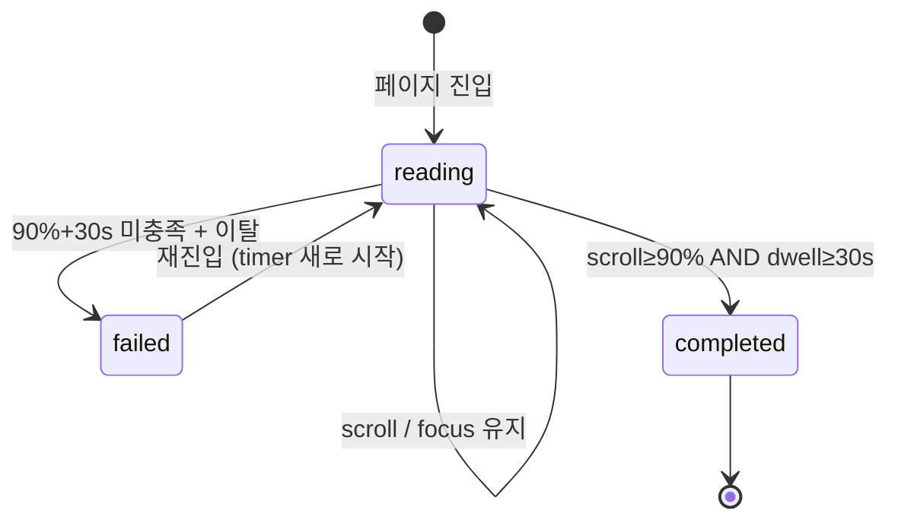
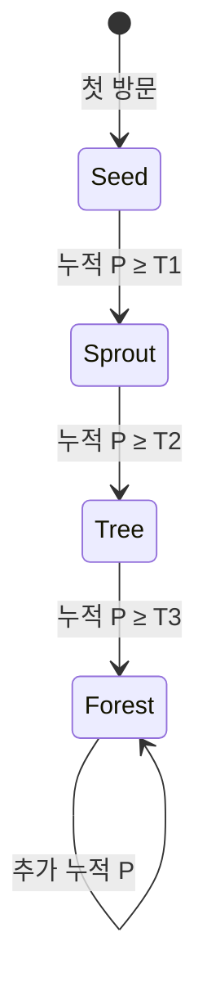
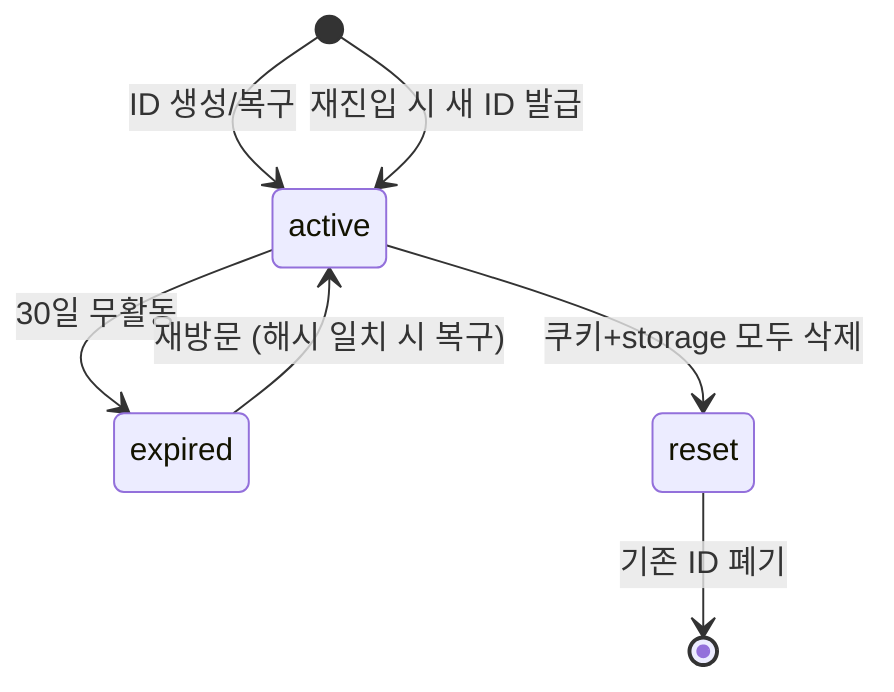

# 03 — News Forest Use-Case Document

> **문서 상태**: v1.0 (MVP)
> **작성일**: 2026-05-01
> **참조 프롬프트**: `/docs/_prompts/03.Use-case.md`
> **사전 참조 문서**: `01-PRD.md`, `02-IA.md`
> **프로젝트 룰**: `/CLAUDE.md`

---

## 1. Actor Definitions

| ID | Actor | 설명 |
|----|-------|------|
| **A-01** | **Anonymous User** | 익명 사용자. device fingerprint를 SHA-256 해시한 ID로만 식별됨. raw ID 비노출. |
| **A-02** | **System (Frontend)** | React SPA. UI 렌더링, 클라이언트 검증(scroll/dwell), 로컬 캐싱, 이벤트 송신 |
| **A-03** | **System (Backend)** | Node.js + Fastify. API, 서버 재검증, 포인트/Tree 트랜잭션, anti-abuse |
| **A-04** | **External News API** | 세계일보 / 연합뉴스 등. Rate limit TBD. 장애 시 캐시된 article fallback |
| **A-05** | **Cache (Redis)** | 세션, rate-limit, 추천 캐싱 |
| **A-06** | **Database (PostgreSQL)** | 영속 데이터 저장 (04-ERD에서 상세) |

---

## 2. State Definitions

### 2.1 Article 상태



### 2.2 Tree 성장 단계



> **Note:** T1 / T2 / T3 thresholds는 04-ERD에서 확정. 현재 가정: T1=50P, T2=200P, T3=500P (TBD).

### 2.3 Session 상태



---

## 3. Use Case Index

| UC ID | 이름 | Primary Actor | 우선순위 |
|-------|------|---------------|---------|
| UC-01 | 첫 방문 & 익명 ID 발급 | A-01 | 🔥 MVP 필수 |
| UC-02 | 온보딩 (3단계) | A-01 | 🔥 MVP 필수 |
| UC-03 | 추천 피드 노출 (Home) | A-01 | 🔥 MVP 필수 |
| UC-04 | Article 진입 & Reading | A-01 | 🔥 MVP 필수 |
| UC-05 | Article 완독 검증 (90%+30s) | A-01, A-03 | 🔥 MVP 필수 |
| UC-06 | 포인트 지급 & Tree 성장 | A-03 | 🔥 MVP 필수 |
| UC-07 | Watering 인터랙션 | A-01, A-03 | 🔥 MVP 필수 |
| UC-08 | 세션 복구 (재방문) | A-01, A-03 | 🔥 MVP 필수 |
| UC-09 | 세션 리셋 (쿠키 삭제 후 재방문) | A-01, A-03 | 🔥 MVP 필수 |
| UC-10 | Dashboard 통계 조회 | A-01 | MVP |
| UC-11 | Forest Explore & 다른 사용자 진입 | A-01 | MVP |
| UC-12 | External API 장애 fallback | A-03, A-04 | MVP |
| UC-13 | 다중 탭 동시 reading 제어 | A-01, A-02 | MVP (anti-abuse) |

---

## 4. UC-01 — 첫 방문 & 익명 ID 발급

### 4.1 개요
- **Primary Actor**: A-01 (Anonymous User)
- **Goal**: 첫 방문 사용자에게 익명 ID를 발급하고 다음 단계(온보딩)로 진입.

### 4.2 Preconditions
- 사용자 브라우저에 News Forest 관련 cookie / localStorage 모두 없음.
- 사용자가 `/`, `/onboarding/*`, 또는 `/articles/...`(SEO 진입) 중 하나로 접근.

### 4.3 Postconditions
- DB의 `AnonymousUser` 테이블에 새 row 생성.
- 클라이언트의 localStorage + httpOnly cookie 모두에 anonymous ID(해시) 저장.
- Public-safe UUID 동시 발급 및 저장.

### 4.4 Main Flow

| # | Actor | Action |
|---|-------|--------|
| 1 | A-01 | 첫 진입 (`/` 등) |
| 2 | A-02 (FE) | localStorage / cookie에서 ID 검색 → 없음 |
| 3 | A-02 (FE) | Device fingerprint 수집 (canvas + UA + screen + timezone) |
| 4 | A-02 (FE) | `POST /api/anonymous/register` 호출 (fingerprint 포함) |
| 5 | A-03 (BE) | fingerprint를 server-side salt + SHA-256 해시 |
| 6 | A-03 (BE) | 동일 해시 존재 여부 확인 → 없음이면 새 row 생성 |
| 7 | A-03 (BE) | Public-safe UUID v4 생성 |
| 8 | A-03 (BE) | response: `{ publicId, sessionToken }` (해시 ID는 응답에 포함하지 않음) |
| 9 | A-02 (FE) | localStorage + httpOnly cookie 양측에 저장 |
| 10 | A-02 (FE) | `/onboarding/welcome` 으로 redirect |

### 4.5 Alternative Flow — A1: SEO 유입 (`/articles/:category/:slug` 진입)
- 위 1~9 동일하게 background에서 실행.
- 10번 단계에서 redirect 대신 article을 그대로 보여주고, **온보딩은 article 완독 후 권유** (낮은 마찰).

### 4.6 Exception Handling

| 조건 | 시스템 동작 |
|------|------------|
| Fingerprint 수집 실패 (Canvas blocked 등) | UA + timezone만으로 약식 fingerprint 생성, 로그 남김 |
| `POST /api/anonymous/register` 실패 (network) | 클라이언트에서 임시 ID 생성하여 진행, 다음 성공 호출 시 동기화 |
| DB 동일 해시 conflict | 기존 row 재사용 (UC-08과 동일) |
| Cookie 차단 | localStorage만 사용. 다음 방문 시 fingerprint로 복구 시도 |

### 4.7 UI Considerations
- 사용자에게 "ID 발급 중..." 같은 메시지 노출하지 않음 (백그라운드 처리).
- 첫 paint < 1.5s 유지.

### 4.8 Data Flow
```
[FE] fingerprint → [BE] salt+hash → [DB] AnonymousUser INSERT → [BE] publicId 반환 → [FE] 저장
```

### 4.9 Verification
- ✔ DB `AnonymousUser` row 1건 추가
- ✔ raw fingerprint는 어디에도 저장되지 않음 (CLAUDE.md §9)
- ✔ 사용자는 가입 절차 없이 5초 이내 `/onboarding/welcome` 도달

---

## 5. UC-02 — 온보딩 (3단계)

### 5.1 개요
- **Goal**: 컨셉 학습 + 관심 카테고리 ≥ 1개 선택 → 첫 추천 피드 생성 가능 상태로 만들기.

### 5.2 Preconditions
- UC-01 완료 (anonymous ID 존재).

### 5.3 Postconditions
- `AnonymousUser.preferred_categories` 에 사용자가 선택한 카테고리 코드 저장.
- `onboarding_completed_at` 타임스탬프 저장.

### 5.4 Main Flow

| # | Actor | Action |
|---|-------|--------|
| 1 | A-02 | `/onboarding/welcome` 표시 — 컨셉 1줄 + "다음" 버튼 |
| 2 | A-01 | "다음" 클릭 |
| 3 | A-02 | `/onboarding/concept` 표시 — Reading→Tree 흐름 시각화 |
| 4 | A-01 | "다음" 클릭 |
| 5 | A-02 | `/onboarding/categories` 표시 — 6개 카테고리 칩 |
| 6 | A-01 | ≥ 1개 선택 후 "시작하기" 클릭 |
| 7 | A-03 | `PATCH /api/me/preferences` 호출 → DB 저장 |
| 8 | A-02 | `/home` 으로 redirect |

### 5.5 Alternative Flow — A1: 온보딩 스킵
- 사용자가 도중에 새 탭으로 다른 URL 직접 입력 → onboarding 미완료 상태로도 동작.
- 이 경우 `/home`은 "관심 카테고리를 알려주시면 추천이 더 좋아져요" 배너 노출.

### 5.6 Exception Handling

| 조건 | 시스템 동작 |
|------|------------|
| 카테고리 선택 0개 | "시작하기" 버튼 비활성화 + helper 텍스트 |
| `PATCH /api/me/preferences` 실패 | local에 캐시 후 재시도, 사용자에게는 "다시 시도해볼까요?" 톤 |

### 5.7 Verification
- ✔ DB의 `preferred_categories` 가 사용자 선택과 일치
- ✔ 온보딩 미완료 상태에서도 앱은 동작 (graceful degradation)

---

## 6. UC-03 — 추천 피드 노출 (Home)

### 6.1 개요
- **Goal**: 사용자에게 4섹션(For You / Trending / Recent / Categories) 추천을 보여주기.

### 6.2 Preconditions
- anonymous ID 존재 (UC-01)

### 6.3 Postconditions
- `RecommendationLog` 에 노출된 article ID 기록 (재추천 방지 + AB 분석)

### 6.4 Main Flow

| # | Actor | Action |
|---|-------|--------|
| 1 | A-01 | `/home` 진입 |
| 2 | A-02 | `GET /api/feed/home?sections=for-you,trending,recent,categories` |
| 3 | A-03 | Redis에서 user별 추천 캐시 확인 (TTL 10분) |
| 4 | A-03 | Cache miss 시: `preferred_categories` + `ReadingHistory` 기반 룰 점수 계산 |
| 5 | A-03 | 최근 24h `RecommendationLog` 의 article은 weight ↓ |
| 6 | A-03 | 4섹션 결과 조립 후 응답 + Redis 캐시 저장 |
| 7 | A-02 | Skeleton → 실제 데이터 렌더 |
| 8 | A-03 | (비동기) `RecommendationLog` 에 노출 article 기록 |

### 6.5 Alternative Flow — A1: 신규 사용자 (행동 데이터 없음)
- For You 섹션은 카테고리별 인기 article 1~2개로 대체.
- "더 읽을수록 추천이 정확해져요" 미세한 안내.

### 6.6 Exception Handling

| 조건 | 시스템 동작 |
|------|------------|
| News API 장애 (UC-12 trigger) | 캐시된 article로 응답, "최신 정보는 잠시 후" 배너 |
| Redis 장애 | DB 직접 query로 fallback, latency 증가 |
| article 0건 | Empty state — "첫 기사를 골라볼까요?" + 카테고리 노출 |

### 6.7 UI Considerations
- 4섹션 모두 skeleton 동시 표시 (지연 시 partial reveal)
- Pull-to-refresh (Mobile) / 새로고침 버튼 (Desktop)

### 6.8 Verification
- ✔ 동일 article이 같은 화면에 2번 이상 노출되지 않음
- ✔ 24h 내 본 article은 우선순위 낮음
- ✔ `RecommendationLog` 에 정확히 노출된 article만 기록

---

## 7. UC-04 — Article 진입 & Reading

### 7.1 개요
- **Goal**: 사용자가 article 카드 클릭 → 본문 진입 → reading state 진입.

### 7.2 Preconditions
- anonymous ID 존재
- article이 캐시 또는 DB에 존재

### 7.3 Postconditions
- `ReadingSession` row 생성 (status: `reading`, started_at)

### 7.4 Main Flow

| # | Actor | Action |
|---|-------|--------|
| 1 | A-01 | Home에서 article card 클릭 (또는 SEO 직접 진입) |
| 2 | A-02 | `/articles/:category/:slug` 라우팅 |
| 3 | A-02 | `GET /api/articles/:slug` 호출 |
| 4 | A-03 | DB에서 article 조회 → article 본문 + 메타데이터 응답 |
| 5 | A-03 | `POST /api/reading-sessions` 자동 호출 (FE에서) → `ReadingSession` 생성 |
| 6 | A-02 | 본문 렌더 + ReadingProgressBar 초기화 (0%) |
| 7 | A-02 | Page Visibility API로 dwell timer 시작 |
| 8 | A-02 | scroll listener 부착 (throttle 200ms) |

### 7.5 Alternative Flow — A1: 동일 사용자가 같은 article 재진입
- 24h 내 이미 `completed` 인 경우: 본문은 보여주되 "이미 읽으셨어요" 표시, 포인트 미지급.
- 24h 내 `reading` 또는 `failed` 인 경우: 새 `ReadingSession` 생성 (timer 재시작).

### 7.6 Exception Handling

| 조건 | 시스템 동작 |
|------|------------|
| article 404 | "기사를 찾을 수 없어요" + 카테고리 인덱스로 이동 버튼 |
| API 장애 | 캐시된 본문이 있으면 노출, 없으면 Error state |
| Reduced motion 설정 | ReadingProgressBar는 표시하되 잎사귀 모션 disable |

### 7.7 UI Considerations
- 본문 폰트: Pretendard 또는 Noto Serif KR (16px+, line-height 1.7)
- 광고 0개 (MVP)
- 상단 sticky 진행률 바 2px

### 7.8 Verification
- ✔ `ReadingSession` row 정확히 1건 생성
- ✔ Tab blur 시 dwell timer 멈춤

---

## 8. UC-05 — Article 완독 검증 (가장 핵심 UC)

### 8.1 개요
- **Goal**: scroll ≥ 90% AND dwell ≥ 30s 충족 시 `completed` 상태 전환 + 포인트 지급 트리거.

### 8.2 Preconditions
- UC-04 완료, `ReadingSession` 이 `reading` 상태.

### 8.3 Postconditions
- `ReadingSession.status = 'completed'`, `completed_at` 기록
- UC-06 (포인트 지급) trigger
- 잎사귀 모션 + 카운트업 표시

### 8.4 Main Flow

| # | Actor | Action |
|---|-------|--------|
| 1 | A-02 | scroll 이벤트마다 진행률 계산 (article 본문 영역 기준) |
| 2 | A-02 | dwell timer 누적 (visible 상태일 때만) |
| 3 | A-02 | `progress >= 0.9 && dwell >= 30` 조건 충족 감지 |
| 4 | A-02 | `POST /api/reading-sessions/:id/complete` (scroll·dwell 값 포함) |
| 5 | A-03 | server-side 재검증 — fraud signals 체크 (§8.6 참고) |
| 6 | A-03 | 통과 시 `ReadingSession.status = 'completed'` UPDATE |
| 7 | A-03 | `PointTransaction` INSERT (+10P, type='ARTICLE_COMPLETE') |
| 8 | A-03 | UC-06 trigger (Tree 성장 검사) |
| 9 | A-03 | response: `{ status: 'completed', pointsAwarded: 10, treeStage }` |
| 10 | A-02 | 잎사귀 모션 1회 (350ms ease-out) + 포인트 카운트업 toast |

### 8.5 Alternative Flow

#### A1: 사용자가 90% 스크롤 후 읽지 않고 dwell만 채움
- scroll은 충족했지만 dwell timer가 진행. 30s 충족 시 정상 완독 처리.
- (Note: 빠르게 스크롤만 하고 30s는 dwell이 정상 누적되어야 함 → 어뷰징은 8.6의 "탭 invisible 시 timer 정지"로 차단됨)

#### A2: 사용자가 30s 안에 빠르게 끝까지 스크롤 → tab 닫음
- `complete` 이벤트가 송신되지 않음. session은 `reading` 상태로 timeout (1시간 후 `failed` 처리).

#### A3: 90%만 충족 + 25초만 dwell → tab 닫음
- 미달. 다음 재진입 시 timer 새로 시작 (UC-07 A1 참조).

### 8.6 Exception Handling (Fraud Signals — MVP-friendly)

| 조건 | 시스템 동작 |
|------|------------|
| **dwell < 5초인데 complete 호출** | reject, 로그에 `suspicious=true` 마킹 |
| **scroll 진행률이 step function 처럼 점프** (예: 0% → 95% 단번에) | reject, 로그 마킹 |
| **Page Visibility = hidden 상태에서 dwell만 누적** | server에서 dwell 무효 처리 |
| **동일 article 24h 내 중복 complete 시도** | reject, "이미 읽으셨어요" |
| **동일 사용자 동일 분에 다수 complete** (>3건/min) | rate-limit, 임시 차단 |
| **Article 본문 길이 대비 dwell 비율이 비현실적** (예: 5000자 article을 30초만에) | warn 로그 (차단은 X — false positive 우려) |
| **complete 호출 시 ReadingSession 미존재** | 400 Bad Request, 로그 |

> **Note:** Fraud detection은 MVP에서 룰 기반만. 머신러닝 등 over-engineering 회피 (CLAUDE.md §6.4).

### 8.7 UI Considerations
- 잎사귀 모션은 `prefers-reduced-motion` 시 disable, 대신 정적 아이콘 변경
- 진행률 바는 완독 직후 사라짐 (잠시 100%로 머무른 뒤 fade out)

### 8.8 Verification
- ✔ Server 재검증 통과한 경우만 `PointTransaction` 생성됨
- ✔ Tab blur 시 dwell timer 멈춤 (60초 dwell 동안 30초 invisible이면 actual=30초)
- ✔ 동일 article 24h 내 중복 +10 불가
- ✔ 의심 케이스는 모두 로그 보존 (audit-friendly)

---

## 9. UC-06 — 포인트 지급 & Tree 성장

### 9.1 개요
- **Goal**: PointTransaction 생성 후 누적 포인트 기준 Tree stage 평가 및 갱신.

### 9.2 Preconditions
- UC-05 통과 (또는 UC-07 Watering 통과)

### 9.3 Postconditions
- `PointTransaction` row 1건
- 필요 시 `Tree.stage` UPDATE

### 9.4 Main Flow

| # | Actor | Action |
|---|-------|--------|
| 1 | A-03 | `PointTransaction` INSERT (트랜잭션 내) |
| 2 | A-03 | `Tree.total_points` UPDATE (denormalized 합계) |
| 3 | A-03 | 현재 stage 와 thresholds(T1/T2/T3) 비교 |
| 4 | A-03 | stage 변경 필요 시 `Tree.stage` UPDATE + `tree_growth_history` INSERT |
| 5 | A-03 | 응답에 `{ pointsAwarded, currentStage, stageChanged }` 포함 |
| 6 | A-02 | stageChanged = true 면 트랜지션 모션 (350ms / Tree→Forest는 500ms) |

### 9.5 Exception Handling

| 조건 | 시스템 동작 |
|------|------------|
| `PointTransaction` INSERT 후 `Tree` UPDATE 실패 | 트랜잭션 ROLLBACK, 사용자에게는 "다시 시도해볼까요?" |
| 동시성: 동일 사용자 두 article 동시 complete | DB row-level lock (`SELECT FOR UPDATE`) 또는 `INSERT ... ON CONFLICT` |

### 9.6 Verification
- ✔ Atomic: PointTransaction과 Tree update가 같은 transaction
- ✔ Stage downgrade는 절대 발생하지 않음 (단조 증가)
- ✔ PointTransaction은 hard delete 금지 (CLAUDE.md §9, audit)

---

## 10. UC-07 — Watering 인터랙션

### 10.1 개요
- **Goal**: 다른 사용자 나무에 물 주기 → 행위자에게 +2P, 대상자에게 시각 피드백.

### 10.2 Preconditions
- 행위자: anonymous ID 존재
- 대상자: 다른 사용자의 publicId 가 유효
- 24h 내 동일 (행위자, 대상자) 페어 watering 기록 없음

### 10.3 Postconditions
- `WateringInteraction` row 1건
- 행위자 `PointTransaction` +2P
- 대상자에게는 다음 방문 시 알림 큐에 적재

### 10.4 Main Flow

| # | Actor | Action |
|---|-------|--------|
| 1 | A-01 | `/forest/explore` 에서 사용자 카드 클릭 |
| 2 | A-02 | `/forest/u/:publicId` 진입 |
| 3 | A-01 | "물 주기" 버튼 클릭 |
| 4 | A-02 | `POST /api/watering` (target publicId) |
| 5 | A-03 | publicId → 내부 user_id 조회 |
| 6 | A-03 | 24h 내 동일 페어 존재 확인 (DB unique 또는 query) |
| 7 | A-03 | `WateringInteraction` INSERT |
| 8 | A-03 | UC-06 trigger (행위자 +2P) |
| 9 | A-03 | 대상자 알림 큐에 적재 (`pending_notifications`) |
| 10 | A-02 | 물방울 모션 1회 (300ms) + +2 카운트업 |

### 10.5 Alternative Flow — A1: 자기 자신에게 watering 시도
- publicId == 행위자 publicId → 400 reject, "자신의 나무에는 물을 줄 수 없어요"

### 10.6 Exception Handling

| 조건 | 시스템 동작 |
|------|------------|
| 24h 내 중복 시도 | reject, "오늘은 이미 물을 줬어요" |
| 대상자 미존재 (publicId invalid) | 404 |
| 동시 다중 클릭 | DB unique 제약(`UNIQUE(actor_id, target_id, day_kst)`)으로 1건만 성공 |
| 어뷰징: 짧은 시간에 다수 다른 대상에 watering | rate-limit (분당 5회 등 TBD) |

### 10.7 Verification
- ✔ 동일 페어 24h 내 1회만 INSERT 성공
- ✔ 행위자만 +2P 지급, 대상자에게 직접 포인트 X (어뷰징 방지)

---

## 11. UC-08 — 세션 복구 (재방문)

### 11.1 개요
- **Goal**: 기존 사용자가 재방문 시 anonymous ID 자동 복구.

### 11.2 Preconditions
- localStorage 또는 cookie 중 하나 이상에 ID 존재.

### 11.3 Postconditions
- 동일 anonymous ID로 세션 active 유지.

### 11.4 Main Flow

| # | Actor | Action |
|---|-------|--------|
| 1 | A-01 | 재방문 |
| 2 | A-02 | localStorage / cookie 검사 → ID 존재 |
| 3 | A-02 | `GET /api/me` 호출 (sessionToken 동봉) |
| 4 | A-03 | sessionToken 검증, 유효 시 user 정보 반환 |
| 5 | A-02 | 세션 active 상태 유지 |

### 11.5 Alternative Flow — A1: 30일 무활동 후 재방문 (expired)
- sessionToken 검증 실패 → expired 상태.
- 동일 fingerprint 재계산 → 동일 해시 매칭 시 ID 복구 + 새 sessionToken 발급.

### 11.6 Exception Handling

| 조건 | 시스템 동작 |
|------|------------|
| sessionToken 위변조 | 401, ID 폐기 후 UC-01 재진입 |
| localStorage / cookie 둘 중 하나만 존재 | 다른 한쪽으로 복원 동기화 |

### 11.7 Verification
- ✔ 30일 이내 재방문은 ID 변경 없이 복구
- ✔ raw fingerprint는 검증 후 즉시 폐기 (메모리에만 존재)

---

## 12. UC-09 — 세션 리셋 (쿠키 삭제 후 재방문)

### 12.1 개요
- **Goal**: 사용자가 cookie + localStorage 모두 삭제했을 때의 동작.

### 12.2 Preconditions
- 클라이언트에 어떤 ID도 없음.

### 12.3 Main Flow

| # | Actor | Action |
|---|-------|--------|
| 1 | A-01 | 재방문 |
| 2 | A-02 | ID 검색 실패 |
| 3 | A-02 | fingerprint 재계산 |
| 4 | A-03 | 동일 해시 매칭 → 기존 row 발견 |
| 5 | A-03 | 기존 user에 새 sessionToken 발급 |
| 6 | A-02 | localStorage + cookie 재저장 |

### 12.4 Alternative Flow — A1: fingerprint 매칭 실패
- 새 anonymous ID 발급 (UC-01과 동일). 이전 활동은 복구 불가.

### 12.5 Exception Handling

| 조건 | 시스템 동작 |
|------|------------|
| Canvas blocked 등으로 fingerprint 변경 | 새 ID 발급 (false negative 허용) |

### 12.6 Verification
- ✔ best-effort 복구. 실패해도 사용자 경험에 큰 손해 없음 (anonymous 특성)

---

## 13. UC-10 — Dashboard 통계 조회

### 13.1 Main Flow

| # | Actor | Action |
|---|-------|--------|
| 1 | A-01 | `/dashboard` 진입 |
| 2 | A-02 | `GET /api/me/stats` |
| 3 | A-03 | 누적 P / 완독 기사 수 / 7일 streak / 평균 dwell 응답 |
| 4 | A-02 | StatCard + ActivityChart 렌더 |

### 13.2 Verification
- ✔ 통계는 server-truth, 클라이언트 캐시는 60s TTL

---

## 14. UC-11 — Forest Explore & 다른 사용자 진입

### 14.1 Main Flow

| # | Actor | Action |
|---|-------|--------|
| 1 | A-01 | `/forest/explore` 진입 |
| 2 | A-03 | Random 8명 + Top stage 4명 + Recent 4명 (총 16개 카드) |
| 3 | A-02 | 카드 grid 렌더 |
| 4 | A-01 | 카드 클릭 → `/forest/u/:publicId` |
| 5 | UC-07 trigger 가능 |

### 14.2 Privacy 고려
- 다른 사용자 카드는 닉네임(랜덤 생성), 나무 단계, 누적 P 만 노출. 활동 history 비노출.

---

## 15. UC-12 — External News API 장애 Fallback

### 15.1 Trigger
- News API 응답 실패 (timeout / 5xx) 또는 rate-limit.

### 15.2 Main Flow

| # | Actor | Action |
|---|-------|--------|
| 1 | A-04 | API 응답 실패 |
| 2 | A-03 | retry 2회 (exponential backoff: 1s, 3s) |
| 3 | A-03 | 모두 실패 → 캐시된 article 사용 |
| 4 | A-03 | "최신 정보는 잠시 후" 배너 정보 응답에 포함 |
| 5 | A-02 | 배너 표시 (warn tone, red 금지) |

### 15.3 Verification
- ✔ News API 장애가 사용자 경험을 차단하지 않음
- ✔ 5xx 비율이 임계 초과 시 admin 알림 (Phase 2)

---

## 16. UC-13 — 다중 탭 동시 Reading 제어

### 16.1 Trigger
- 동일 사용자가 동일 article을 두 탭에서 동시 진입.

### 16.2 Main Flow

| # | Actor | Action |
|---|-------|--------|
| 1 | A-01 | Tab A에서 article 진입 → ReadingSession A 생성 |
| 2 | A-01 | Tab B에서 동일 article 진입 |
| 3 | A-02 | BroadcastChannel API로 Tab B에 "이미 reading 중" 전달 |
| 4 | A-02 | Tab B는 timer 시작하지 않고 readonly 표시 |
| 5 | UC-05 통과 시 active tab(A)만 complete 호출 |

### 16.3 Alternative Flow — A1: 다른 article 동시 reading
- 허용. 단 server에서 동일 사용자가 동시에 reading 중인 session 수가 비현실적이면(>3) 의심 로그.

### 16.4 Verification
- ✔ 다중 탭으로 동일 article 중복 +10P 지급 불가능

---

## 17. Business Rules & Constraints (요약)

| 룰 ID | 정책 |
|-------|------|
| BR-01 | 완독: scroll ≥ 90% AND dwell ≥ 30s (CLAUDE.md §2 절대 룰) |
| BR-02 | 완독 포인트: +10 |
| BR-03 | Watering 포인트: +2 (행위자만) |
| BR-04 | Watering 24h 1회 / 동일 페어 |
| BR-05 | 완독 24h 1회 / 동일 article |
| BR-06 | dwell timer는 Page Visibility = visible 일 때만 누적 |
| BR-07 | 동일 article 다중 탭 진입 시 첫 탭만 timer 활성 |
| BR-08 | Tree stage 단조 증가 (downgrade 없음) |
| BR-09 | PointTransaction은 audit-friendly, hard delete 금지 |
| BR-10 | News API 장애 시 캐시 fallback |
| BR-11 | Public-safe UUID는 한 번 생성 후 변경되지 않음 |

---

## 18. Exception Handling Summary

| 카테고리 | 대응 원칙 |
|----------|----------|
| 네트워크 / API 장애 | retry → fallback → graceful degradation. red alert 금지, 따뜻한 톤 |
| 어뷰징 의심 | 차단 + 로그. false positive 우려가 큰 경우 warn-only |
| 동시성 | DB transaction + unique constraint |
| 세션 만료 | 자동 복구 시도 → 실패 시 새 ID 발급 |
| 데이터 미존재 | Empty state (자연 메타포) — error로 처리하지 않음 |

---

## 19. Data Requirements & Data Flow

### 19.1 핵심 데이터 흐름 (UC-04 → UC-05 → UC-06)

```
[FE]
  ├─ ReadingSession 생성 요청
  ├─ scroll/dwell 누적
  └─ complete 이벤트 송신
      ↓
[BE] 재검증
  ├─ fraud signal 체크
  ├─ ReadingSession.status='completed'
  ├─ PointTransaction INSERT (+10)
  └─ Tree update + stage 평가
      ↓
[FE] 잎사귀 모션 + 카운트업
```

### 19.2 RecommendationLog Flow (UC-03)
```
사용자 home 진입 → feed 요청 → BE 룰 점수 계산 → 결과 응답
                                        ↓
                              RecommendationLog INSERT (비동기)
```

### 19.3 데이터 의존성
- `PointTransaction` → `Tree.total_points` (UPDATE, denormalized)
- `ReadingSession.status='completed'` → `PointTransaction(type='ARTICLE_COMPLETE')`
- `WateringInteraction` → `PointTransaction(type='WATERING')` (행위자만)

> 상세 스키마는 04-ERD에서 정의.

---

## 20. Security & Privacy Considerations

| 항목 | 정책 |
|------|------|
| Device fingerprint raw 값 | 메모리에서만 사용 후 즉시 폐기, 어디에도 저장 X |
| Anonymous ID | server-side salt + SHA-256 해시. URL 비노출 |
| Public-safe UUID | 노출 가능. 별도 컬럼. 변경 불가 |
| sessionToken | httpOnly + Secure + SameSite=Lax cookie |
| API 통신 | HTTPS 강제 |
| PointTransaction | audit-friendly, hard delete 금지 |
| 사용자 데이터 삭제 요청 (PIPA 권리) | settings에서 데이터 초기화 가능. soft delete + 30일 후 hard purge |
| Rate limiting | Redis 기반 IP + anonymous ID 이중 |

---

## 21. UI Considerations Summary

- Empty / Loading / Error는 모두 자연 메타포 + 따뜻한 톤 (CLAUDE.md §6, 05-DesignGuide에서 상세)
- 모든 모션은 350ms 이하, `prefers-reduced-motion` 존중
- 색상은 디자인 토큰만 사용 (Hex 직접 X)
- tabular-nums 폰트로 포인트 카운트업

---

## 22. 정합성 검증

### 22.1 vs `01-PRD.md`

| 항목 | PRD | UseCase | 일치 |
|------|-----|---------|------|
| 완독 검증 (90%+30s) | §4.1 | UC-05 | ✅ |
| 완독 +10P / Watering +2P | §4.2 | UC-05, UC-07 | ✅ |
| 4단계 Tree | §4.3 | UC-06, §2.2 | ✅ |
| 익명 ID 해시 저장 | §4.5, §12 | UC-01, §20 | ✅ |
| Watering 24h 제한 | §4.6 | UC-07 BR-04 | ✅ |
| Fraud-friendly MVP (룰 기반) | §4.1 | UC-05 §8.6 | ✅ |
| 외부 API fallback | §9 | UC-12 | ✅ |

### 22.2 vs `02-IA.md`

| 항목 | IA | UseCase | 일치 |
|------|----|----|------|
| 핵심 페이지 | §5.1 | 각 UC가 페이지 매핑 | ✅ |
| 카테고리 6종 | §6.1 | UC-02 | ✅ |
| 추천 4섹션 | §6.2 | UC-03 | ✅ |
| Public UUID 노출 | §2.3 | UC-01, UC-07, §20 | ✅ |
| Reading progress · 완독 모션 | §7.1 | UC-04, UC-05 | ✅ |

### 22.3 vs `CLAUDE.md`

| 항목 | CLAUDE.md | UseCase | 일치 |
|------|-----------|---------|------|
| 절대 룰 (90%/30s/+10P/+2P) | §2 | BR-01~05 | ✅ |
| device-based 익명 ID + 해시 | §2, §9 | §20 | ✅ |
| TIMESTAMPTZ + UTC | §2 | (UC-08, UC-12 timestamp 정책) — 04-ERD에서 확정 | 🔜 |
| MVP-friendly fraud (no ML) | §6.4 | UC-05 §8.6 Note | ✅ |
| PointTransaction hard delete 금지 | §9 | BR-09, §20 | ✅ |

---

## 끝맺음

이 Use-Case 문서는 News Forest MVP의 **시스템 동작 + state transition + exception handling** 을 정의합니다.
다음 단계인 **04-ERD** 는 본 문서의 데이터 흐름을 PostgreSQL 스키마로 구체화합니다.
